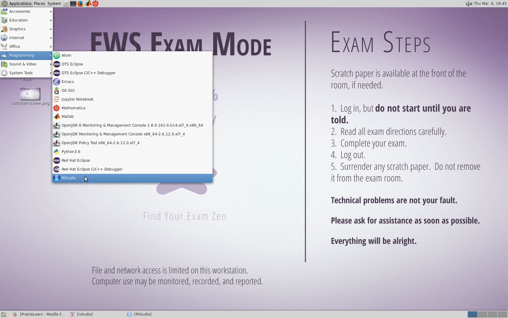
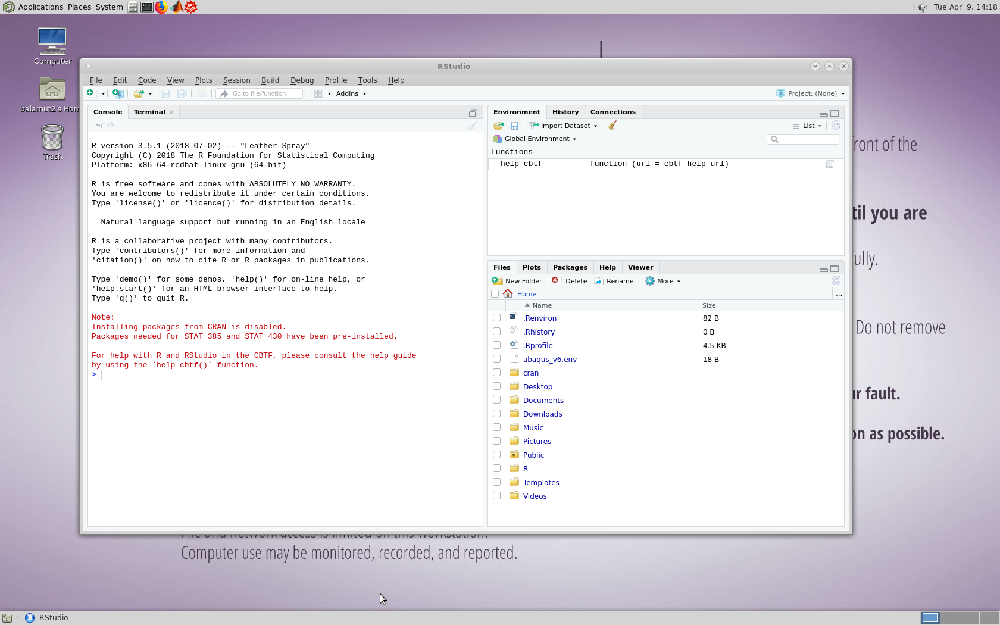
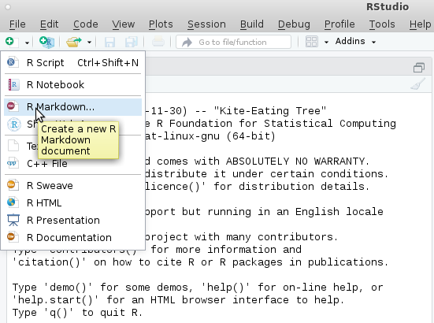
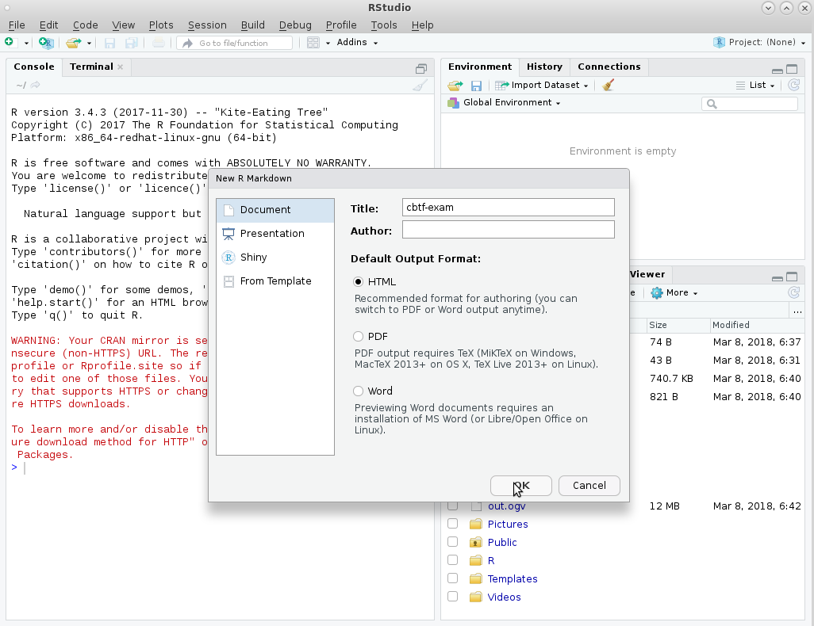
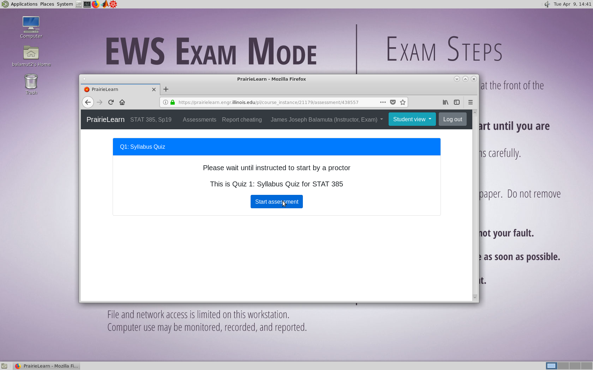

Accessing RStudio in *CBTF*
===========================

To access *RStudio* in the Computer-Based Testing Facility (CBTF),
please go to upper right corner of your monitor and press
`"Applications"`. In the drop down menu that appears, mouse over the
`"Programming"` submenu. This opens up another menu that shows the
different program editors available. Please click on the `"RStudio"`
menu item.

When *RStudio* opens, you will see **red text** indicating that *CRAN*
cannot be reached. **This is okay and is by design to meet the CBTF
security model requirements.** All packages required by STAT 385, STAT
430 DSPM, STAT 432, and CE 202 have been pre-installed on the CBTF
computer.

Creating an RMarkdown Document
==============================

Please keep your work in an *RMarkdown* document. To create an
*RMarkdown* document, press the “White Plus” on the green background in
the upper left corner and go down to the “R Markdown…” entry.

This will open a window asking what kind of *RMarkdown* document you
would like. Type in the `Title:` field `"CBTF Exam"` and then press
okay.

From there, you should be ready to go! Please wait for the **proctors**
to tell you when to being the exam. We wish you the best of luck and
good ability on your exams and quizzes using *R*!

Common Errors
=============

Below are some common errors appear from time to time when attempting to
use *R* and *RStudio* in the CBTF.

### Package Installation

**Avoid trying to install packages**. As was shown in the beginning, the
package installation feature is disabled within the CBTF. Courses that
use *R* in the CBTF have all the necessary components for their
assessments.

### Accessing Data

Pay close attention to where data is saved. Make sure to place the data
file in the same folder that contains the *RMarkdown* or *R* Script to
ensure it is able to be read in. Failure to do so may result in the data
set not being found. These errors would look like:

    Error in file(file, "rt") : cannot open the connection
    In addition: Warning message:
    In file(file, "rt") :
      cannot open file 'bad/path/to/data.rds': No such file or directory

### R Session Aborted

When writing more advanced code, RStudio may crash during its execution.
The crash error will look like:

This indicates that there is a show-stopping bug in the code being
executed. Try to either debug the code or start from scratch and slowly
build it up.

The proctors insides the CBTF **cannot** provide debugging assistance.
